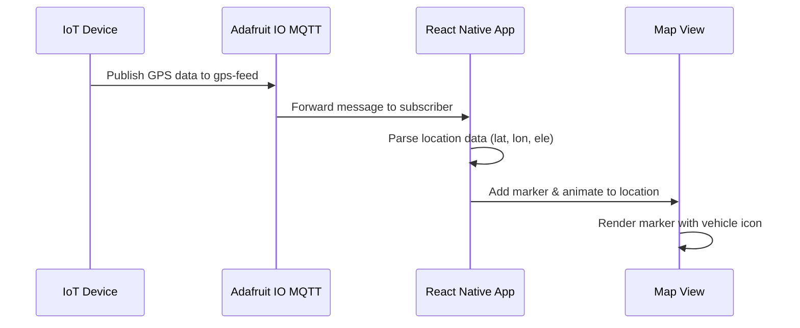
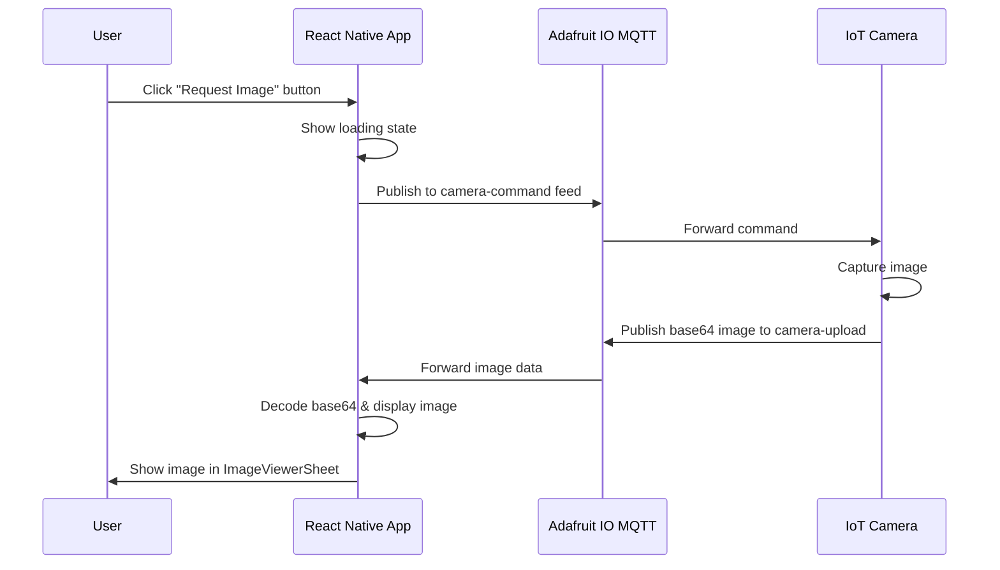
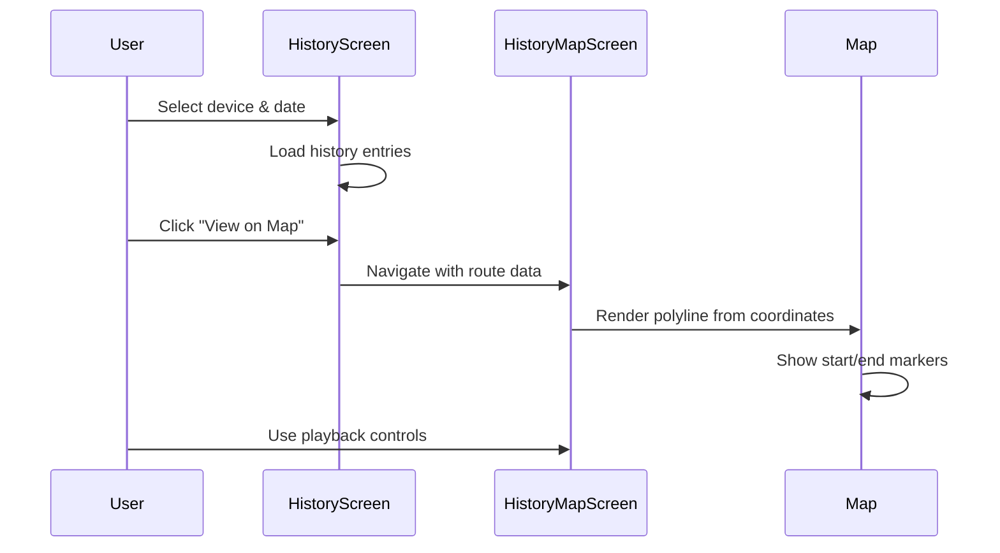

# GPS Tracking Application - Technical Documentation

> **Tài liệu kỹ thuật dự án GPS Tracking cho Backend Team**

## 📋 Overview / Tổng quan

Đây là ứng dụng GPS Tracking được xây dựng trên nền tảng **React Native** sử dụng **Ignite boilerplate**. Ứng dụng cho phép theo dõi vị trí GPS thời gian thực, xem lịch sử di chuyển, và điều khiển camera IoT thông qua giao thức **MQTT** (Adafruit IO).

### Tech Stack

| Component                   | Technology                  |
| --------------------------- | --------------------------- |
| **Framework**               | React Native (Expo) v0.81.5 |
| **Navigation**              | React Navigation 7.x        |
| **Map**                     | React Native Maps           |
| **Real-time Communication** | MQTT (mqtt.js v5.14.1)      |
| **IoT Platform**            | Adafruit IO                 |
| **State Management**        | React Hooks, Context API    |
| **Storage**                 | MMKV (react-native-mmkv)    |
| **Language**                | TypeScript 5.9.2            |

---

## 🏗️ Architecture / Kiến trúc

### Project Structure

```
GPS/
├── app/
│   ├── components/         # Reusable UI components
│   │   ├── Map/           # Map components (SharedMapView)
│   │   ├── SvgIcon/       # Icon system
│   │   └── Screen.tsx     # Base screen wrapper
│   ├── screens/           # Application screens
│   │   ├── Map/           # Live GPS tracking
│   │   ├── History/       # History tracking & playback
│   │   ├── Devices/       # Device management
│   │   ├── Settings/      # App settings
│   │   ├── Auth/          # Authentication (Signin/Signup)
│   │   ├── Alerts/        # Alerts/Notifications
│   │   └── Splash/        # Splash screen
│   ├── services/          # Business logic services
│   │   ├── mqtt/          # MQTT services
│   │   │   ├── MqttService.ts           # Core MQTT client
│   │   │   ├── GpsFeedService.ts        # GPS data handler
│   │   │   ├── CameraUploadService.ts   # Camera image receiver
│   │   │   └── CameraCommandService.ts  # Camera command sender
│   │   ├── maps/          # Map utility services
│   │   └── api/           # REST API services
│   ├── navigators/        # Navigation configuration
│   │   ├── AppNavigator.tsx
│   │   ├── MainTabNavigator.tsx
│   │   └── navigationTypes.ts
│   ├── hooks/             # Custom React hooks
│   │   └── useMqttConnection.ts
│   ├── context/           # React Context providers
│   ├── theme/             # Theme configuration
│   ├── config/            # App configuration
│   └── utils/             # Utility functions
├── assets/                # Images, icons, fonts
└── .env                   # Environment variables
```

---

## 🎯 Key Features / Tính năng chính

### 1. Live GPS Tracking (Theo dõi GPS thời gian thực)

**Screen:** `LiveMapScreen.tsx`

- Hiển thị vị trí GPS thời gian thực trên bản đồ
- Nhận dữ liệu GPS qua MQTT từ thiết bị IoT
- Auto-focus vào vị trí mới nhất
- Hiển thị markers với thông tin driver và xe
- Hỗ trợ retry connection khi mất kết nối

**Key Components:**

- `SharedMapView`: Wrapper cho React Native Maps
- `MarkerInfoSheet`: Bottom sheet hiển thị thông tin marker
- `ConnectionStatusBadge`: Badge hiển thị trạng thái MQTT connection

### 2. History Playback (Xem lịch sử di chuyển)

**Screens:**

- `HistoryScreen.tsx` (Danh sách lịch sử)
- `HistoryMapScreen.tsx` (Bản đồ playback)

**Features:**

- Hiển thị danh sách các điểm GPS trong quá khứ
- Filter theo ngày
- Xem route trên bản đồ
- Thông tin chi tiết: timestamp, địa chỉ, status (Active/Idle/Alert)

### 3. Camera IoT Integration (Tích hợp camera IoT)

**Flow:**

1. User nhấn "Request Image" từ `MarkerInfoSheet`
2. App gửi command qua MQTT topic `camera-command`
3. Camera nhận lệnh và chụp ảnh
4. Camera upload ảnh (base64) qua MQTT topic `camera-upload`
5. App nhận và hiển thị ảnh trong `ImageViewerSheet`

**Services:**

- `CameraCommandService`: Gửi lệnh điều khiển camera
- `CameraUploadService`: Nhận ảnh từ camera

### 4. Device Management (Quản lý thiết bị)

**Screen:** `DevicesScreen.tsx`

- Danh sách các thiết bị GPS
- Thông tin trạng thái thiết bị
- Navigation đến live tracking của từng thiết bị

### 5. Settings (Cài đặt)

**Screen:** `SettingsScreen.tsx`

- User profile settings
- App preferences
- Notification settings
- About & version info

---

## 🔌 MQTT Integration (Adafruit IO)

### Connection Configuration

```typescript
// File: app/services/mqtt/MqttService.ts

const ADAFRUIT_IO_CONFIG = {
  host: "io.adafruit.com",
  port: 443,
  protocol: "wss", // WebSocket Secure
}

// Credentials from .env
{
  username: "huynhptnghia",
  aioKey: "YOUR_ADAFRUIT_IO_KEY"
}
```

### MQTT Topics & Message Formats

#### 1. GPS Location Feed

**Topic:** `huynhptnghia/feeds/gps-feed`

**Message Format (Publish):**

```json
{
  "lat": 10.762622, // Latitude (number)
  "lon": 106.660172, // Longitude (number)
  "ele": 0 // Elevation in meters (optional, default: 0)
}
```

**Usage:**

```typescript
// Publish GPS location
gpsFeedService.publishLocation(lat, lon, ele)

// Subscribe to GPS updates
const unsubscribe = gpsFeedService.onLocationUpdate((location) => {
  console.log(location.lat, location.lon, location.ele)
})
```

#### 2. Camera Upload Feed

**Topic:** `huynhptnghia/feeds/camera-upload`

**Message Format (Publish from IoT device):**

```json
{
  "b64": "iVBORw0KGgoAAAANSUhEUgAA...", // Base64 encoded image (string, required)
  "size": 15360, // File size in bytes (number, optional)
  "type": "jpeg" // Image type: "jpeg" | "png" (string, optional)
}
```

**Usage:**

```typescript
// Subscribe to camera images
const unsubscribe = cameraUploadService.onImageReceived((image) => {
  const imageUri = `data:image/${image.type || "jpeg"};base64,${image.b64}`
  // Display imageUri in Image component
})
```

#### 3. Camera Command Feed

**Topic:** `huynhptnghia/feeds/camera-command`

**Message Format (Publish from app):**

```json
{
  "action": "capture", // Command type: "capture" | "config"
  "quality": 12 // JPEG quality (1-12, higher = better quality)
}
```

**Usage:**

```typescript
// Send camera capture command
const command = JSON.stringify({
  action: "capture",
  quality: 12,
})
cameraCommandService.sendCommand(command)
```

### Connection Lifecycle

```typescript
// 1. Connect to MQTT
await mqttService.connect({
  username: "huynhptnghia",
  aioKey: "YOUR_ADAFRUIT_IO_KEY",
})

// 2. Subscribe to feeds
mqttService.subscribe("gps-feed")
mqttService.subscribe("camera-upload")

// 3. Register message listeners
const unsubscribe = mqttService.onMessage((message) => {
  console.log(message.topic, message.message)
})

// 4. Publish data
mqttService.publishJSON("gps-feed", { lat: 10.762622, lon: 106.660172 })

// 5. Disconnect
mqttService.disconnect()
```

---

## 📱 Navigation Structure

```
AppNavigator
├── SplashStack
│   └── SplashScreen
├── AuthStack (commented out)
│   ├── SigninScreen
│   └── SignupScreen
└── MainTabNavigator (Bottom Tabs)
    ├── Map Tab
    │   └── MapStack
    │       └── LiveMapScreen
    ├── Devices Tab
    │   └── DevicesStack
    │       └── DevicesScreen
    ├── History Tab
    │   └── HistoryStack
    │       ├── HistoryScreen (List view)
    │       └── HistoryMapScreen (Map playback)
    └── Settings Tab
        └── SettingsStack
            └── SettingsScreen
```

### Navigation Types

```typescript
// app/navigators/navigationTypes.ts

export type AppStackParamList = {
  Splash: undefined
  Auth: undefined
  MainTab: undefined
  History: NavigatorScreenParams<HistoryStackParamList>
  Map: NavigatorScreenParams<MapStackParamList>
}

export type MainTabParamList = {
  Map: undefined
  Devices: undefined
  History: undefined
  Settings: undefined
}

export type MapStackParamList = {
  LiveMapScreen: { deviceId?: string }
}

export type HistoryStackParamList = {
  HistoryScreen: { deviceId?: string }
  HistoryMapScreen: { route: RouteData }
}
```

---

## 📊 Data Models / Cấu trúc dữ liệu

### Location Update

```typescript
interface LocationUpdate {
  lat: number // Latitude
  lon: number // Longitude
  ele?: number // Elevation (optional)
}
```

### Camera Image

```typescript
interface CameraImage {
  b64: string // Base64 encoded image data
  size?: number // File size in bytes
  type?: string // Image MIME type (jpeg, png)
}
```

### Map Marker

```typescript
interface MapMarker {
  id: string
  coordinate: {
    latitude: number
    longitude: number
  }
  title?: string // Driver name
  description?: string // Vehicle info
}
```

### History Log Entry

```typescript
interface HistoryLogEntry {
  id: string
  time: string // HH:mm format
  period: "AM" | "PM"
  event: string // Event title
  address: string // Location address
  status: StatusType // "Active" | "Idle" | "Alert"
}

type StatusType = "Active" | "Idle" | "Alert"
```

### Marker Info (Device Info)

```typescript
interface MarkerInfo {
  id: string
  name: string // Driver name
  vehicle: {
    make: string
    model: string
    color: string
  }
  licensePlate: string
  status: "Active" | "Idle" | "Offline"
}
```

---

## 🔐 Environment Variables

```env
# .env file
GOOGLE_MAPS_API_KEY_ANDROID=YOUR_GOOGLE_MAPS_API_KEY_ANDROID
GOOGLE_MAPS_API_KEY_IOS=YOUR_GOOGLE_MAPS_API_KEY_IOS
ADAFRUIT_USERNAME=huynhptnghia
ADAFRUIT_AIO_KEY=YOUR_ADAFRUIT_IO_KEY
```

> ⚠️ **Security Note:** These are sensitive credentials. Ensure `.env` is in `.gitignore`.

---

## 🔄 Key Flows / Luồng hoạt động chính

### Flow 1: Live GPS Tracking



### Flow 2: Camera Capture Request



### Flow 3: View History on Map



---

## 🛠️ Backend Requirements / Yêu cầu Backend

### 1. REST API Endpoints (Optional - if needed)

Hiện tại app đang sử dụng MQTT cho real-time communication. Nếu cần lưu trữ persistent data, Backend cần cung cấp:

#### GET `/api/devices`

Lấy danh sách thiết bị GPS

**Response:**

```json
{
  "devices": [
    {
      "id": "device-001",
      "name": "Michael Turner",
      "vehicle": {
        "make": "Toyota",
        "model": "Camry",
        "color": "Black"
      },
      "licensePlate": "6KTC491",
      "status": "Active",
      "lastUpdate": "2026-02-05T09:30:00Z"
    }
  ]
}
```

#### GET `/api/history/:deviceId`

Lấy lịch sử GPS của thiết bị

**Query Parameters:**

- `startDate`: ISO date string (e.g., "2026-02-05")
- `endDate`: ISO date string
- `limit`: Number of records (default: 100)

**Response:**

```json
{
  "deviceId": "device-001",
  "entries": [
    {
      "id": "log-001",
      "timestamp": "2026-02-05T08:30:00Z",
      "location": {
        "lat": 10.762622,
        "lon": 106.660172,
        "address": "123 Main St, Ho Chi Minh City"
      },
      "status": "Active",
      "event": "Arrived at destination"
    }
  ]
}
```

#### POST `/api/locations`

Lưu GPS location (optional, nếu muốn backup từ MQTT)

**Request Body:**

```json
{
  "deviceId": "device-001",
  "lat": 10.762622,
  "lon": 106.660172,
  "ele": 0,
  "timestamp": "2026-02-05T08:30:00Z"
}
```

### 2. MQTT Broker (Adafruit IO)

Backend **KHÔNG** cần setup MQTT broker. App đang sử dụng **Adafruit IO** làm MQTT broker.

Nếu muốn tự host MQTT broker:

- Recommend: **Mosquitto** hoặc **EMQX**
- Port: 1883 (MQTT), 8883 (MQTT over SSL), 8083 (WebSocket)
- Authentication: Username/Password hoặc API key

### 3. Reverse Geocoding Service (Optional)

Để convert GPS coordinates → địa chỉ (address), có thể sử dụng:

- **Google Maps Geocoding API**
- **OpenStreetMap Nominatim API**
- **MapBox Geocoding API**

Example request:

```
GET https://maps.googleapis.com/maps/api/geocode/json?latlng=10.762622,106.660172&key=YOUR_API_KEY
```

---

## 📦 Installation & Setup

### Prerequisites

- Node.js >= 20.0.0
- Bun package manager (hoặc npm/yarn)
- Expo CLI
- Android Studio / Xcode (for native builds)

### Installation Steps

```bash
# 1. Clone repository
cd /Users/macos/Desktop/GPS

# 2. Install dependencies
bun install

# 3. Setup environment variables
cp .env.example .env
# Edit .env với credentials của bạn

# 4. Start development server
bun run start

# 5. Build for device (iOS)
bun run build:ios:dev

# 6. Build for device (Android)
bun run build:android:dev
```

### Running on Simulator/Emulator

```bash
# iOS Simulator
bun run ios

# Android Emulator
bun run android
```

---

## 🧪 Testing & Verification

### Test MQTT Connection

```bash
# Install MQTT client
npm install -g mqtt

# Subscribe to GPS feed
mqtt subscribe -h io.adafruit.com -p 1883 \
  -u huynhptnghia \
  -P YOUR_ADAFRUIT_IO_KEY \
  -t huynhptnghia/feeds/gps-feed

# Publish test GPS data
mqtt publish -h io.adafruit.com -p 1883 \
  -u huynhptnghia \
  -P YOUR_ADAFRUIT_IO_KEY \
  -t huynhptnghia/feeds/gps-feed \
  -m '{"lat":10.762622,"lon":106.660172,"ele":0}'
```

---

## 🔍 Debugging Tips

### MQTT Connection Issues

1. Check Adafruit IO credentials trong `.env`
2. Verify Internet connectivity
3. Check MQTT broker status: https://io.adafruit.com/status
4. Enable verbose logging:

```typescript
// In MqttService.ts, add before connect()
client.on("connect", () => console.log("[MQTT] Connected!"))
client.on("error", (err) => console.error("[MQTT] Error:", err))
client.on("message", (topic, payload) => {
  console.log("[MQTT] Received:", topic, payload.toString())
})
```

### GPS Not Updating

1. Verify device is publishing to correct topic: `username/feeds/gps-feed`
2. Check message format matches expected JSON structure
3. Confirm subscription is active:

```typescript
console.log(mqttService.getConnectionStatus()) // Should be true
```

### Camera Image Not Displaying

1. Validate base64 string format
2. Check image size (Adafruit IO có limit ~100KB/message)
3. Verify MIME type trong URL: `data:image/jpeg;base64,...`

---

## 📝 Additional Notes for Backend Team

### Data Persistence Strategy

Hiện tại app **KHÔNG** lưu trữ dữ liệu persistent trên device (ngoài user settings). Mọi GPS history đều cần được fetch từ backend API hoặc MQTT retained messages.

**Recommendations:**

1. Backend nên subscribe vào MQTT topics và lưu tất cả GPS data vào database
2. Implement pagination cho history API (50-100 records/request)
3. Cung cấp filtering theo: deviceId, date range, status

### Real-time Performance

- MQTT message latency: ~200-500ms (Adafruit IO)
- GPS update frequency: Recommend 5-10 seconds/update
- Camera image upload: Nên compress ảnh trước khi upload (quality: 12 = ~70-80KB)

### Security Considerations

1. **API Key Rotation:** Định kỳ rotate Adafruit AIO key
2. **Device Authentication:** Mỗi IoT device nên có unique credentials
3. **Data Encryption:** MQTT over WSS (TLS) để encrypt traffic
4. **Access Control:** Implement user-device authorization ở backend

### Scalability Limits

**Adafruit IO Free Tier:**

- 30 messages/minute
- 5 feeds active
- 30 days data retention

**Nếu scale lớn hơn:**

- Upgrade Adafruit IO plan HOẶC
- Self-host MQTT broker (Mosquitto/EMQX)
- Implement message batching/throttling

---

## 🤝 Contact & Support

**Project:** GPS Tracking Application  
**Tech Lead:** [Your Name]  
**Repository:** huuphat26/TrackerGps  
**MQTT Platform:** Adafruit IO (io.adafruit.com)

**For Backend Integration Questions:**

- MQTT topics & message formats: See section "MQTT Integration"
- API requirements: See section "Backend Requirements"
- Data models: See section "Data Models"

---

## 📚 References

- [React Native Documentation](https://reactnative.dev/)
- [React Navigation](https://reactnavigation.org/)
- [Adafruit IO MQTT API](https://io.adafruit.com/api/docs/mqtt.html)
- [MQTT.js Documentation](https://github.com/mqttjs/MQTT.js)
- [React Native Maps](https://github.com/react-native-maps/react-native-maps)
- [Ignite Boilerplate](https://github.com/infinitered/ignite)

---

_Last Updated: 2026-02-05_  
_Version: 0.0.1_
